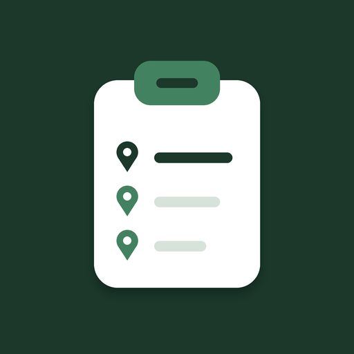

<div align="center">



# PrediApp

**La app de la congregación para tener todo a mano: la salida de hoy, el mapa del territorio, los "No pasar" y los programas del mes.**

Hecha para el celular · Se instala como app · Funciona sin internet


</div>

---

## ✨ Qué hace

| Sección | Qué encuentras |
|---|---|
| 🏠 **Inicio** | La fecha de hoy, el horario de la salida, el **mapa del territorio que toca**, las direcciones de **No pasar** y un botón para llegar a la casa de salida. |
| 📅 **Predicación** | El programa del mes en PDF, con selector de meses (siempre abre el mes actual) y zoom. También la vista de **Grupos**. |
| 📖 **Vida y Ministerio** | La guía de actividades del mes, con el mismo selector de meses. |
| 🗺️ **Mapa** | El mapa general de territorios, optimizado para celular. |

Además:

- 🌗 **Modo claro y oscuro.**
- 📴 **Funciona sin conexión**: muestra lo último que se cargó.
- 📲 **Se instala** en la pantalla principal como cualquier app.
- 🔒 **Los programas privados no se exponen**: la app solo muestra el historial de PDFs que tú subes.

---

## 📲 Cómo instalarla

**Android (Chrome)**
1. Abre el enlace de la app.
2. Menú **⋮** → **Instalar app**.

**iPhone (Safari)**
1. Abre el enlace de la app en Safari.
2. Toca **Compartir** → **Añadir a pantalla de inicio**.

> En iPhone solo Safari puede instalar la app. Chrome en iPhone no lo permite.

---

## 🧭 Cómo se usa

1. **Inicio** muestra automáticamente la salida de hoy. Toca el pin 📍 para ir a la casa de salida.
2. Baja para ver el mapa del territorio y los **No pasar** de ese territorio. Con *Ver todos los territorios* los ves todos.
3. En **Predicación** y **Vida y Ministerio** elige el mes arriba. Con **−** y **+** acercas el PDF, y **PDF ↗** lo abre completo.
4. En **Mapa** tienes el mapa general de la congregación.

---

## 🛠️ Para quien administra

### Subir los programas del mes

Los programas son PDF que se guardan en la carpeta `historial/` de este mismo repositorio.

1. En la app, abre **⚙️ Ajustes de guardado** (abajo en Inicio).
2. Pega tu **token de GitHub** (se guarda solo en ese dispositivo).
3. Elige el tipo (Predicación o Vida y Ministerio), el **mes** y el **PDF**.
4. Toca **Subir programa**. Si ese mes ya existía, se reemplaza.

**Crear el token**

1. En GitHub: *Settings → Developer settings → Personal access tokens (fine-grained)*.
2. Dale acceso **solo a este repositorio**.
3. Permiso: **Contents → Read and write**.

### Agregar "No pasar"

En `index.html`, busca el bloque `NO_PASAR` y agrega las direcciones por número de territorio:

```js
const NO_PASAR = {
  '12': ['Los Aromos 345', 'Calle Mayo 120, depto 4'],
  '13': ['Pasaje Sur 88']
};
```

### Mapas por territorio

El bloque `TERR_MAPS` relaciona cada número de territorio con su mapa de Google My Maps. Solo cambias el identificador (`mid`) de cada uno.

---

## 📁 Archivos del proyecto

```
├── index.html               ← La app completa
├── sw.js                    ← Modo sin conexión
├── manifest.webmanifest     ← Nombre e iconos para instalarla
├── icon-192.png             ← Ícono de la app
├── icon-512.png             ← Ícono de la app (grande)
├── icon-maskable-512.png    ← Ícono adaptable de Android
├── apple-touch-icon.png     ← Ícono de iPhone
├── favicon.svg              ← Ícono de la pestaña del navegador
└── historial/               ← PDF de los programas (se crea al subir el primero)
    ├── index.json
    ├── pred/2026-10.pdf
    └── vym/2026-10.pdf
```

---

## 🚀 Publicarla en GitHub Pages

1. Sube todos los archivos a la **raíz** del repositorio.
2. En el repositorio: **Settings → Pages**.
3. En *Build and deployment*, elige **Deploy from a branch**, rama `main`, carpeta `/ (root)`.
4. Espera uno o dos minutos. Tu app quedará en `https://TU-USUARIO.github.io/NOMBRE-DEL-REPO/`.

### Actualizar la app

Cuando cambies `index.html` o `sw.js`, súbelos de nuevo reemplazando los anteriores. Para que todos reciban la versión nueva, cambia el número de versión en `sw.js` (`const C='predicacion-v…'`).

---

## 🔐 Privacidad

- El repositorio debe ser **público** para que la app pueda leer los PDF, así que cualquiera con el enlace puede abrirlos. **Evita subir información que no quieras que se vea.**
- El token de GitHub se guarda solo en el celular del administrador y nunca aparece en el código.
- Las páginas privadas de programas no se enlazan desde la app.

---

## 🎨 Diseño

- **Verde** `#1B382B` · **Verde medio** `#438260` · **Blanco** `#FFFFFF`
- Tipografías: *Fraunces* para títulos y *Plus Jakarta Sans* para el texto.
- Logo: un tablero con una lista de territorios, pensado para verse bien incluso en tamaño pequeño.

---

<div align="center">

Hecha con cariño para la congregación 💚

</div>
